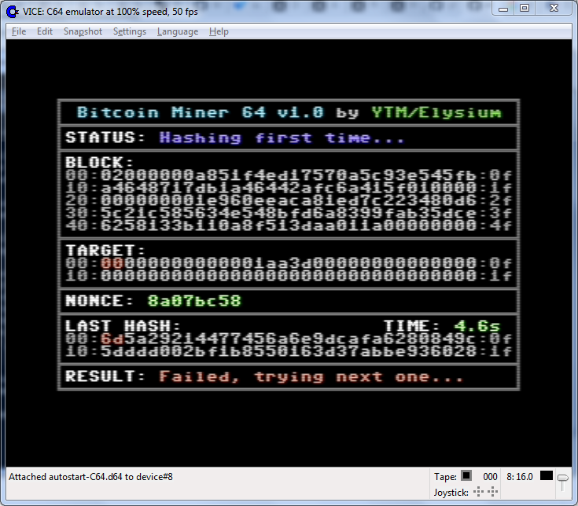
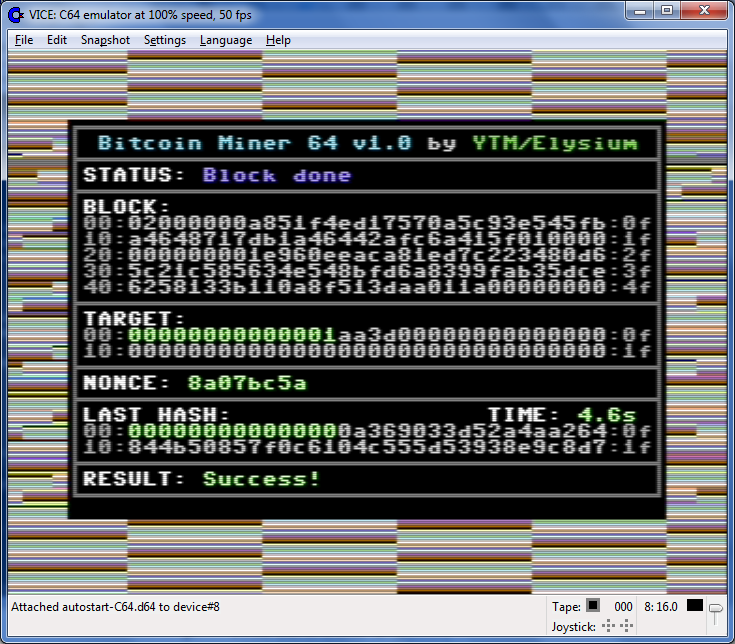

# C64 Bitcoin miner

This is a Bitcoin miner for C64.

It can run in demo mode or communicate with [ngbtminer] over serial link (1200 baud, 8N1) to access Bitcoin blockchain.

# Screenshots

## Success

# Pros & cons

## Pros

- low memory footprint
- low power usage
- doesn't take over GPU
- dedicated mining equipment

## Cons

- not very fast - 0.2 hash/s (1MHz PAL)

# Credits

Coded by Maciej 'YTM/Elysium' Witkowiak using [cc65](https://github.com/cc65/cc65).

Based on [stacksmashing's work on Bitcoin mining with Game Boy](https://www.youtube.com/watch?v=4ckjr9x214c)

# FAQ

## How to quickly check it out?

Just load and run `miner.prg` in VICE and press 'd' for demo mode. In about 30 minutes (at 100% emulation speed)
you will reach nonce $0000019d, for which the hashed block value is smaler than the test target.

## How to run the miner from within VICE emulator

VICE's x64 emulator can send/receive RS232 communication over TCP socket. My version of ngbtminer will wait for
connections on port 25233.

Setup ngbtminer to connect to your bitcoind (or your mining pool), see original project for more info.
Alternatively you can run the test code: `python3 test_ngbtminer.py` to mine one test block in 5 rounds without bitcoind

1. Start ngbtminer / test_ngbtminer
2. Run VICE's x64, load and run `miner.prg`
3. Setup Vice:
    - Settings -> RS232 settings -> RS232 settings -> RS232 device 1 -> set to NGBTMINER_IP:25233, for example `192.168.2.54:25233`
    - Settings -> RS232 settings -> RS232 user port settings:
       - Enable RS232 userport emulation
       - Userport device - RS232 device 1
       - Userport baud rate - 1200
4. Continue the miner, press any key

## Is this a joke?

No, it really does the same thing that every other miner:

1. Receive block data to be hashed (76 bytes)
2. Append 32-bit nonce at the end
3. Hash twice with `sha256` algorithm
4. Check if result is smaller than the target value (current blockchain difficulty)
5. If not, increase nonce and try again

## Why is it so slow?

The 6502 CPU in C64 runs at about 1MHz and it doesn't handle 32-bit computations very efficiently.

Just enjoy the experience.
